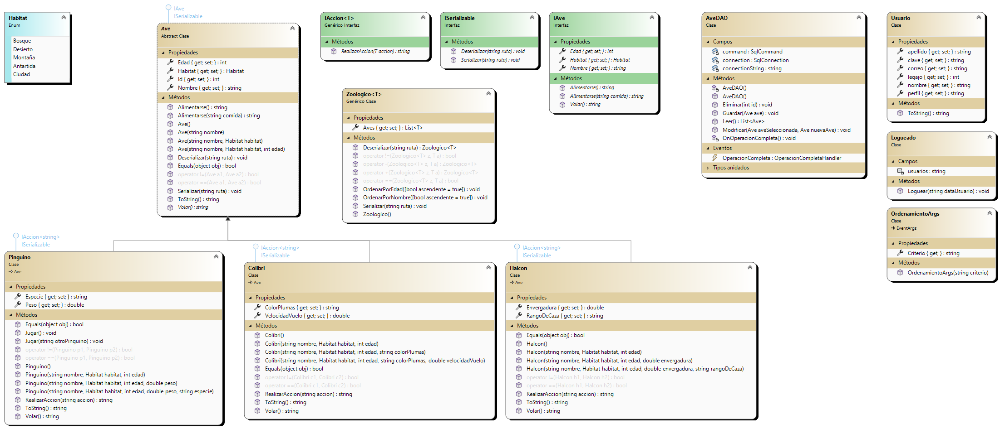

(Para ver una version más avanzada de proyecto cambiarse a la rama **segundo_parcial**)

# CRUD - AVES

## Sobre mí

Me llamo Lautaro Muller y tengo 22 años, nací en Avellaneda pero actualmente vivo en Lanús. Estoy cursando el segundo cuatrimestre de la Tecnicatura en Programación en la UTN y es mi primera vez trabajando con esta tecnología.

## Descripción del proyecto

Aplicación desarrollada en C# utilizando Windows Forms.

La aplicación empieza con un formulario de login donde el usuario ingresa un correo y una contraseña, si los datos son válidos se ingresa a un formulario CRUD(Crear, Leer, Actualizar, Eliminar) 
que permite ingresar, modificar y eliminar distintas aves con sus respectivas características. Al cerrar el formulario las aves cargadas se guardan en un archivo XML del que serán leídas y cargadas al ingresar nuevamente.

El formulario tiene funciones como las de ordenar la lista por nombre o por edad, ambas de forma ascendiente o descendiente, guardar la lista en una ubicación especifica, cargar una 
nueva lista que tengamos en nuestra computadora y ver el historial de los usuarios que se registraron en la aplicación.

## Diagrama de clases

