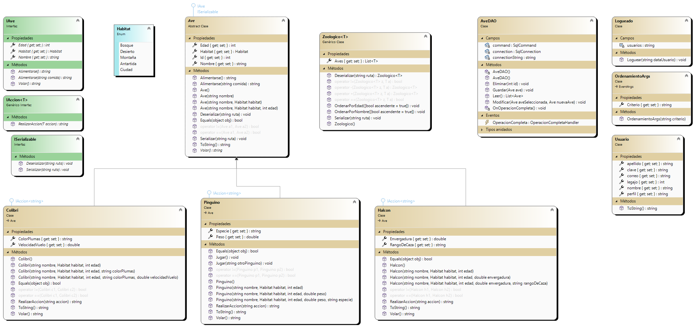

# CRUD - Aves

## Sobre mí

Me llamo Lautaro Muller, tengo 22 años y vivo en Lanús. Estoy cursando el segundo cuatrimestre de la Tecnicatura en Programación en la UTN y es mi primera vez trabajando con esta tecnología.

## Descripción del proyecto

Aplicación desarrollada en C# utilizando Windows Forms.

La aplicación empieza con un formulario de login donde el usuario ingresa un correo y una contraseña, si los datos son válidos se ingresa a un formulario CRUD(Crear, Leer, Actualizar, Eliminar) 
que permite ingresar, modificar y eliminar distintas aves con sus características. Al cerrar el formulario las aves cargadas se guardan en un archivo XML del que serán leídas al ingresar nuevamente.

El formulario también tiene otras funciones como la de ordenar la lista por nombre o por edad, ambas de forma ascendiente o descendiente, guardar la lista en una ubicación especifica o cargar una 
nueva lista que tengamos guardada en nuestra computadora.

## Diagrama de clases

